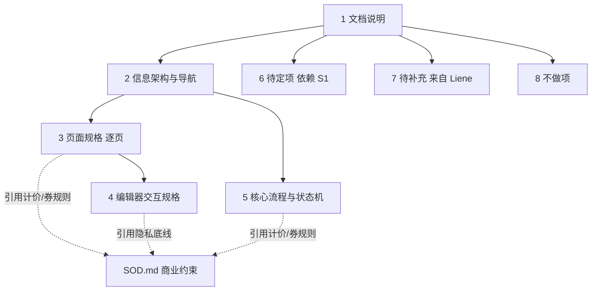
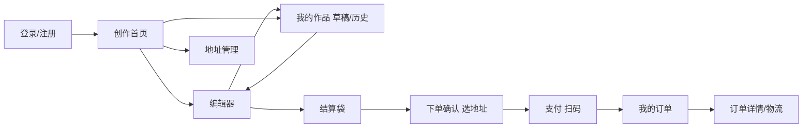

## 产品概述

围绕已稳定的 SOD.md，新建独立 PRD.md，把 Web App 从「功能清单级」下沉到「页面级 + 交互级」规格。PRD 只引用 SOD.md 的商业约束结果（计价规则、券规则、凑单话术、隐私底线），不复述其推导逻辑。Liene S1 截图中的新增点待用户后续列出，以占位章节预留接入位。本次只产出 PRD.md 一个新文件，不改 SOD.md、不做原型、不写代码。

## 核心内容

- 文档说明：界定 PRD 与 SOD.md 的职责边界（SOD.md=产品定义/商业文档；PRD=页面级/交互级规格），列出依赖 S1 PRD 的待定项
- 信息架构与导航：全局页面树、主导航结构、文字版页面流转图
- 逐页规格：登录注册、创作首页、编辑器、我的作品、结算袋、地址管理、下单确认、支付、我的订单——每页给布局/元素/状态/交互/空态错误态
- 编辑器交互规格（独立一章，最重）：工具栏、画布交互、抠图流程与修补笔刷、排版多图案、文字、素材模板、预览校验安全区、撤销重做、自动保存、编辑器状态机
- 核心流程与状态机：创作主流程页面级流转、订单状态机、计价实时计算展示规则、结算袋聚合规则
- 待定项（依赖 S1）与待补充（Liene 参考）显式标注，不假装已定义
- 不做项对齐 SOD「明确不做」

## 技术栈

- 仓库为纯文档仓库，无代码、无构建链路、无依赖配置
- 唯一产出：`PRD.md`（GitHub Flavored Markdown）
- 复用 SOD.md 既有 Markdown 用法：`#`/`##`/`###` 标题、`>` 引用块（用于说明/待定/待补充/不做项）、`|` 表格（页面规格表、状态流转表、工具清单表）、`-` 列表、`**粗体**` 强调、` `` ` 内联代码标记术语

## 实施思路

采用「自顶向下分章撰写」策略：先搭文档骨架（八章），再逐章填充，编辑器章最后写且最详。

**为什么这样分**：

- SOD.md 的「MVP 功能定义」是 8 节功能清单、「用户旅程」是 13 步步骤表——两者都停在「做什么」层级。PRD 的任务是补齐「每页长什么样、用户怎么走、编辑器工具怎么操作」。
- 编辑器是「产品本体」也是最高风险，交互一旦落代码再改成本极高，所以独立成章且最详。
- 商业约束（计价推导、CAC 测算、凑单理由）已在 SOD.md 充分论证，PRD 只引用其结论作为交互规则，避免重复维护两处导致口径漂移。

**关键决策**：

- PRD 与 SOD.md 职责分离：SOD.md 回答「为什么这么做」（本质/定位/定价推导），PRD 回答「具体怎么做」（页面/交互）。交叉处用 `> 见 SOD.md 第 X 节` 引用，不复制。
- 待定项（相纸规格/安全区/拼版规则）与待补充（Liene 新增点）必须显式标注为 `> **待定**` / `> **待补充**`，不假装已定义，防止后续开发基于错误假设动工。
- 文字版流转图用 Mermaid `flowchart` 嵌入，与 SOD.md 现有的表格化旅程表互补——旅程表是步骤级，Mermaid 是页面跳转级。

## 实施要点

- PRD 内所有商业数字（9.9/7.9/5.9、运费 5 元、券面额 5 元、邀请 3 人）必须与 SOD.md 逐字一致，写完逐项核对，防止两文档口径漂移。
- 编辑器状态机须覆盖：空态→上传中→抠图中（云端处理 loading）→编辑中→预览中→保存中，含各态的 UI 反馈与可否中断。
- 抠图流程须定义云端 loading 期的占位与失败回退（AI 抠图失败→退回原图+提示手动修补），因为抠图是云端调用，不可靠。
- 订单状态机须含超时未支付自动关单的分支与关单后是否可恢复。
- 复用 SOD.md 已有术语（结算袋、当期入口人群、安全区、模切轮廓、免运费券、通用券），不引入新名词。
- 引用块 `>` 用于标注说明/待定/待补充，与 SOD.md 既有习惯（`> 说明：`、`> 注意：`、`> 待细化`）一致。

## 架构设计

PRD.md 内部信息流（章节依赖关系）：



PRD 定义的 Web App 全局页面流转（文字版 + Mermaid），核心创作主线：



## 目录结构

```
c:\Users\Nan\Documents\GitHub\stickerondemand\
├── SOD.md            # [不改] 产品定义/商业文档，已稳定
└── PRD.md            # [NEW] Web App 页面级与交互级规格
```

### PRD.md 章节明细

**[NEW] PRD.md**

- **1 文档说明**：与 SOD.md 职责边界（SOD=为什么，PRD=怎么做）；依赖项清单（相纸规格/安全区/拼版规则待 S1 PRD）；术语表复用 SOD（结算袋/当期入口人群/安全区/模切轮廓/免运费券/通用券）
- **2 信息架构与导航**：全局页面树（一级/二级页面清单）；主导航结构（桌面端顶部导航 + 创作入口）；文字版页面流转图（含 Mermaid flowchart，覆盖创作主线与订单/地址支线）
- **3 页面规格（逐页）**：登录注册、创作首页、我的作品（草稿/历史）、结算袋、地址管理、下单确认、支付、我的订单（列表/详情/物流）。每页统一规格表：布局区划 / 核心元素 / 页面状态 / 关键交互 / 空态 / 错误态。编辑器单独成第 4 章不在此列。
- **4 编辑器交互规格（独立一章）**：工具栏与工具清单表；画布交互（缩放/旋转/移动/层级/多选对齐手势）；抠图流程（AI 抠图云端调用→loading 占位→失败回退→修补笔刷：橡皮/恢复/笔刷大小/撤销）；排版与多图案排布（一张相纸排若干图案、吸附对齐）；文字工具（添加/字体/字号/颜色/编辑）；素材与起点模板面板（边框/形状/字体/通用装饰，嵌编辑器内，无 IP）；预览与校验（安全区/越界提示/模切轮廓/白边所见即所得）；撤销重做；自动保存与草稿；编辑器状态机（空态→上传中→抠图中→编辑中→预览中→保存中，各态 UI 反馈与可否中断）
- **5 核心流程与状态机**：创作主流程页面级流转（比 SOD 用户旅程更细到页面跳转，Mermaid flowchart）；订单状态机（待支付→制作中→已发货→已完成 / 超时未支付自动关单，Mermaid stateDiagram）；计价实时计算与展示规则（累进阶梯表直引 SOD、运费 N=1 收 5 / N≥2 包邮、券互斥/单笔限 1 张通用券、结算页「再加 1 张只需多付 X 元」话术触发点）；结算袋聚合规则（多作品聚合、每作品份数、按总张数计价、持久保存）
- **6 待定项**：依赖 S1 PRD——相纸规格、单张图案数上限、异形切割边距与安全区、拼版规则。显式 `> **待定**` 标注。
- **7 待补充（来自 Liene 参考）**：占位章节，预留后续接入。显式 `> **待补充**` 标注，说明用户将列出 Liene 截图中 SOD 未覆盖的功能/交互。
- **8 不做项**：对齐 SOD「明确不做」——小程序/App/多端、独立模板商城/UGC 模板市场/作品社区、分享/晒单、AI 生图。

## Agent Extensions

### SubAgent

- **code-explorer**
- Purpose: 快速核对 SOD.md 全文中的商业数字（9.9/7.9/5.9、运费 5 元、券面额 5 元、邀请 3 人、N=1 收运费/N≥2 包邮）与术语口径，确保 PRD 引用时逐字一致，防止两文档口径漂移
- Expected outcome: 输出 SOD.md 中所有定价/券/凑单相关数字与关键术语的精确清单，供 PRD 撰写时逐项核对