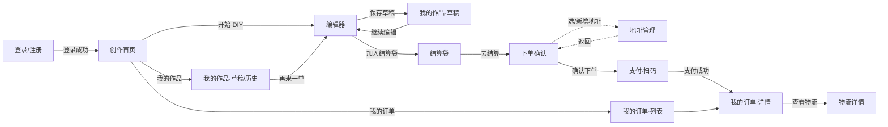
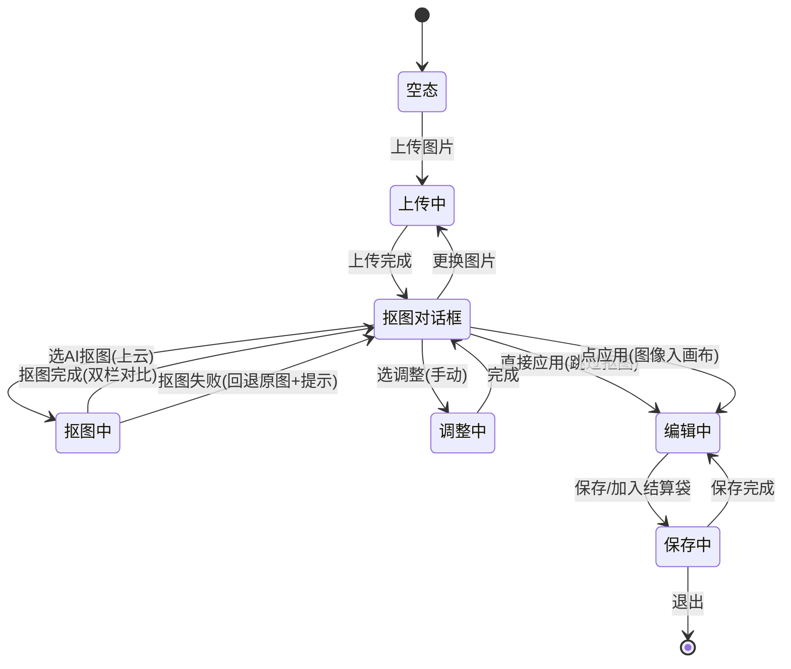
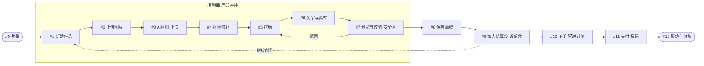
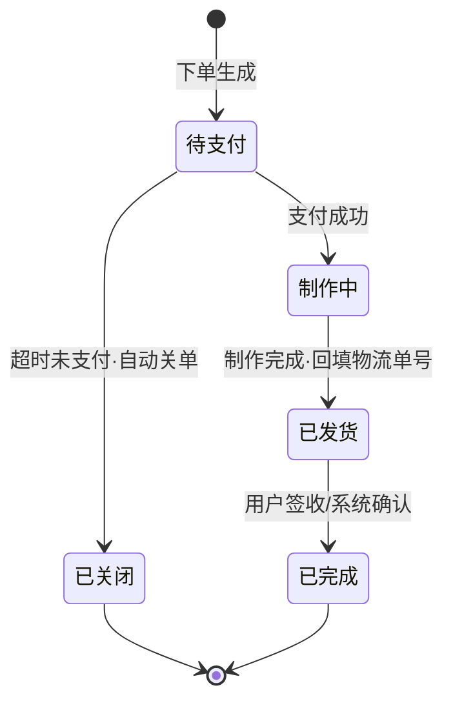

# SOD Web App PRD

> 本文是 SOD Web App 的**页面级与交互级规格**。回答「具体怎么做」。
> 与 `SOD.md` 的关系：`SOD.md` 回答「为什么这么做」（本质 / 定位 / 人群 / 定价推导 / 获客成本），本文回答「怎么做」（页面 / 交互 / 状态机）。涉及商业约束的交叉处一律引用 `SOD.md`，不复制推导，避免两文档口径漂移。

## 1. 文档说明

### 1.1 适用范围

- 本规格覆盖 SOD Web App（浏览器端）MVP 的全部页面与交互。
- **不含**小程序 / App / 多端（见 `SOD.md`「明确不做」）。

### 1.2 依赖项

以下内容依赖极印 AI 贴纸照片打印一体机 S1 的 PRD，本文不假装已定义，统一归入第 6 章「待定项」：

- 相纸规格（一张 = 一张 7 寸相纸的精确尺寸 / 像素 / DPI）
- 单张相纸容纳图案数上限
- 异形切割的边距与安全区规则
- 后台拼版规则（一张相纸一个打印文件）

### 1.3 术语表（复用 `SOD.md`，不引入新名词）

| 术语 | 含义 | 出处 |
|---|---|---|
| 结算袋 | 一次结算聚合多个不同作品、每个可设份数、按总张数计价的容器；非传统商品购物车 | SOD.md §5 |
| 当期入口人群 | 起步阶段聚焦的亚文化圈层（手帐 / 潮玩 / 谷子爱好者）；本质人群之外、转化最快的入口 | SOD.md §核心目标人群 |
| 安全区 | 画布上图案不得越出的边界，越界会被模切切掉；规则待 S1 | SOD.md §3 |
| 模切轮廓 | 贴纸最终按图案轮廓切割的边界线，预览中须所见即所得 | SOD.md §3 |
| 免运费券 | 新注册即得 1 张，仅 N=1 订单可用，免 5 元运费 | SOD.md §优惠券 |
| 通用券 | 邀请 3 位新用户完成注册得 1 张（面额 5 元，可累计，账号上限 5 张，有效期 30 天），任意订单可用，单笔限 1 张 | SOD.md §优惠券 |

---

## 2. 信息架构与导航

> 本章节描述全局页面树、主导航结构、页面流转图。

### 2.1 全局页面树

| 一级页面 | 二级 / 子页 | 说明 |
|---|---|---|
| 登录 / 注册 | — | 进入即要求登录（数据干净，见 `SOD.md` §用户旅程#0） |
| 创作首页 | — | 登录后落地页，主入口「开始 DIY」 |
| 编辑器 | — | 产品本体，全屏沉浸 |
| 我的作品 | 草稿 / 历史 | 草稿可继续编辑；历史可「再来一单」 |
| 结算袋 | — | 聚合作品 + 份数，角标显示总张数 |
| 地址管理 | 地址列表 / 新增·编辑 | 可从下单确认页唤起 |
| 下单确认 | — | 选地址、确认份数与张数、应用券、看实付 |
| 支付 | — | 微信 / 支付宝扫码 |
| 我的订单 | 订单列表 / 订单详情 / 物流详情 | 状态流转 + 物流查看 |

### 2.2 主导航结构（桌面端）

- 顶部导航条目（登录后）：**创作** · 我的作品 · 结算袋〔角标显示总张数〕· 我的订单 · 〔头像〕账号（下拉：地址管理、退出）
- **编辑器全屏时隐藏顶部导航**，保持沉浸；右上角退出按钮回到创作首页，未保存则提示保存为草稿
- 未登录访问任意页 → 强制跳登录 / 注册

### 2.3 页面流转图

> 创作主线（实线）+ 订单 / 地址支线（虚线箭头从下单确认唤起地址管理）。编辑器与「我的作品·草稿」「结算袋」可双向往返。



---

## 3. 页面规格（逐页）

> 本章节给出非编辑器页面的逐页规格。编辑器单独成第 4 章。

> 逐页规格统一格式：**布局区划 / 核心元素 / 页面状态 / 关键交互 / 空态 / 错误态**。编辑器不在此列，见第 4 章。

### 3.1 登录 / 注册

- **布局**：居中卡片，背景留白。
- **核心元素**：① 微信登录（扫码 / 网页授权） ② 手机号 + 短信验证码登录 ③ 切换两种方式。
- **页面状态**：未发送验证码 / 验证码已发送（倒计时 60s）/ 登录中。
- **关键交互**：微信登录扫码成功或验证码校验通过 → 登录成功 → 跳创作首页。新用户注册即发 **1 张免运费券**（见 `SOD.md` §优惠券）。
- **空态**：无（首屏即登录）。
- **错误态**：验证码错误 / 失效、微信授权失败、手机号已注册（若走注册分支）——均原地提示，不跳页。

### 3.2 创作首页

- **布局**：顶部主导航 + 主区。
- **核心元素**：① 主 CTA「开始 DIY」→ 新建作品进编辑器 ② 我的作品（草稿 / 历史）入口 ③ 结算袋入口（角标总张数） ④ 我的订单入口。
- **页面状态**：常规。
- **关键交互**：「开始 DIY」创建一张 7 寸相纸空白画布并进入编辑器（MVP 只有一种纸张规格，见 `SOD.md` §3 与本文第 6 章）。
- **空态**：无草稿 / 无历史 / 无订单时，对应入口显示引导文案而非空白。
- **错误态**：无。

### 3.3 我的作品（草稿 / 历史）

- **布局**：Tab 切换「草稿 / 历史」+ 列表网格。
- **核心元素**：作品缩略图、名称、更新时间、张数 / 份数。
- **页面状态**：草稿 Tab / 历史 Tab。
- **关键交互**：草稿 → 「继续编辑」进编辑器（恢复草稿）；历史作品 → 「再来一单」（复用设计，加入结算袋，可设份数）。删除草稿。
- **空态**：无草稿 / 无历史时显示「开始你的第一张」引导 CTA。
- **错误态**：草稿加载失败 → 提示重试。

### 3.4 结算袋

- **布局**：作品列表 + 右侧 / 底部结算条。
- **核心元素**：每个作品一行（缩略图、份数步进器、小计张数）；结算条显示**总张数 N、累进计价实付、去结算按钮**。
- **页面状态**：有作品 / 空袋。
- **关键交互**：调份数 → 实时重算总价；移除作品；「去结算」→ 下单确认。**结算袋持久保存**——离开不丢失（见 `SOD.md` §凑单#4）。
- **空态**：空袋显示「从编辑器把作品加入这里」引导。
- **错误态**：计价异常 → 提示刷新。

> **计价口径**：实付按「总张数累进」实时计算，规则见第 5.3 节与 `SOD.md` §计价规则。

### 3.5 地址管理

- **布局**：地址列表 + 新增 / 编辑表单（弹层或子页）。
- **核心元素**：收货人、手机号、详细地址、是否默认、编辑 / 删除。
- **页面状态**：列表 / 新增 / 编辑。
- **关键交互**：增、删、改、查；设默认地址；从下单确认页唤起时选中后返回并回填。
- **空态**：无地址显示「添加收货地址」。
- **错误态**：表单校验失败（手机号格式、必填项）原地提示。

### 3.6 下单确认

- **布局**：上区收货地址卡 → 中区作品 / 张数明细 → 下区计价与券 → 底部「确认下单」。
- **核心元素**：地址卡（可换 / 新增）、各作品份数、总张数 N、运费、券应用区、实付金额。
- **页面状态**：常规 / 应用券后重算。
- **关键交互**：
  - 选 / 新增地址（唤起地址管理）。
  - 应用券：**免运费券（面额 5 元，即免运费）仅 N=1 可用；通用券（面额 5 元，有效期 30 天）任意订单可用、单笔限 1 张**（见 `SOD.md` §防滥用）。券应用后实付实时重算。
  - **凑单话术**：结算页提示「再加 1 张，只需多付 X 元」——最强「1→2，第二张只要 4.9 元」（14.9→19.8，因第 2 张起免运费）；次强「4→5，第 5 张只要 5.9 元」（35.6→41.5）。按当前 N 命中最近一档触发（见 `SOD.md` §凑单#2）。
  - 「确认下单」→ 生成订单 → 进支付页。
- **空态**：无地址 → 引导新增。
- **错误态**：券不满足条件、地址缺失——均原地提示，不跳转。

> **待定**：免运费券与通用券作用于不同维度（运费 vs 商品价），**是否允许同一 N=1 订单叠加使用待确认**；MVP 默认允许（二者互不冲突），最终以 `SOD.md` 商业确认为准。

### 3.7 支付

- **布局**：居中扫码区。
- **核心元素**：微信支付 / 支付宝二维码、应付金额、倒计时。
- **页面状态**：待支付 / 支付中 / 支付成功 / 超时关单。
- **关键交互**：扫码支付；支付成功 → 跳我的订单·详情（状态「制作中」）；**超时未支付自动关单**（见 `SOD.md` §用户旅程#11、§订单状态）。
- **空态**：无。
- **错误态**：支付失败 / 关单 → 提示并可重新下单（关单后订单不可恢复，需新建订单）。

### 3.8 我的订单（列表 / 详情 / 物流）

- **布局**：列表 → 详情 → 物流子页。
- **核心元素**：
  - 列表：订单卡（缩略图、张数、实付、状态、时间）。
  - 详情：作品明细、地址、计价明细、状态时间线、物流入口、（待支付时）去支付。
  - 物流：物流公司、运单号、轨迹。
- **页面状态**：**订单状态流转 待支付 → 制作中 → 已发货 → 已完成**（含超时未支付自动关单，见 `SOD.md` §7）。详见第 5.2 节订单状态机。
- **关键交互**：待支付订单 → 「去支付」；已发货 → 「查看物流」。
- **空态**：无订单显示「去创作你的第一张」。
- **错误态**：物流查询失败 → 提示重试。

---

## 4. 编辑器交互规格

> 本章节是产品本体，最重。给出工具栏、画布交互、抠图流程与修补、排版、文字、素材、预览校验、撤销重做、自动保存、编辑器状态机。

> 编辑器是产品本体、最高风险，交互一旦落代码再改成本极高，故本章最详。

### 4.1 整体布局

```
┌──────────────────────────────────────────────┐
│ 顶部工具条：撤销/重做 · 保存草稿 · 加入结算袋 · 退出 │
├──────┬───────────────────────────────┬───────┤
│ 左侧  │                               │ 右侧  │
│ 素材   │  中央画布（7 寸相纸，所见即所得） │ 属性  │
│ 面板   │   上传图 · 素材 · 文字 · 模板    │ 面板  │
│       │                               │       │
├──────┴───────────────────────────────┴───────┤
│ 底部：缩放控件 / 适配画布 / 标尺开关 / 安全区开关   │
└──────────────────────────────────────────────┘
```

- **所见即所得**：中央画布即最终成品效果（含模切轮廓 / 白边 / 越界提示），**无独立「预览模式」**——所有校验实时呈现在画布上（见 4.7）。
- **画布底色**：默认白色（对应相纸本色）；可切换为淡白灰，用于勾边色选白色时显现描边效果（见 4.4 描边）。
- **全屏沉浸**：进入编辑器隐藏主导航；右上角退出，未保存提示存草稿。
- **左侧素材面板**：上传图 / 素材 / 文字 / 起点模板 四个 Tab。
- **右侧属性面板**：选中对象时显示其属性（变换 / 描边 / 图层等，见 4.4）；未选中时隐藏。
- **加入结算袋**（顶部工具条）：点击 → 当前作品存为成品并加入结算袋 → 弹「已加入结算袋」轻提示，提供「去结算 / 继续创作」两个入口；**缺省留在编辑器**继续创作，不强制跳转。

### 4.2 工具栏与工具呈现

> 工具按**呈现方式**分四类，避免用户面对一堆按钮不知所措。

**A. 顶部工具条（常驻，全局操作）**

| 按钮 | 作用 |
|---|---|
| 撤销 / 重做 | 全局历史栈（见 4.8） |
| 保存草稿 | 手动保存（自动保存见 4.9） |
| 加入结算袋 | 作品入袋（见 4.1） |
| 退出 | 退出编辑器，未保存提示存草稿 |

**B. 左侧素材面板（Tab 切换，创作入口）**

| Tab | 内容 |
|---|---|
| 上传图 | 上传图片 → 进入抠图对话框（见 4.3） |
| 素材 | 官方素材库（通用无 IP，见 4.6） |
| 文字 | 添加 / 编辑文字（见 4.5） |
| 起点模板 | 空白布局框架（见 4.6） |

**C. 右侧属性面板（选中对象时出现）**

选中图素 / 文字时显示其属性：变换（位置 / 尺寸 / 旋转）、描边 / 勾边（颜色 / 粗细，见 4.4）、图层顺序、翻转、锁定等。

**D. 画布浮动快捷条（选中对象时贴在对象附近）**

复制 / 删除 / 置顶置底 等高频操作，点击对象即出现，点空白消失。

**工具清单**（入口归属汇总）：

| 工具 | 入口 | 作用 |
|---|---|---|
| 上传图片 | 左侧·上传图 Tab | JPEG / PNG 上传（**建议补 HEIC**，见 `SOD.md` §3） |
| AI 抠图 / 调整 / 直接应用 | 上传后对话框（见 4.3） | 抠图三选一 |
| 选择 / 移动 | 画布默认手势 | 选中、拖动、缩放、旋转 |
| 文字 | 左侧·文字 Tab | 添加 / 编辑文字 |
| 素材 / 模板 | 左侧·素材·模板 Tab | 套用边框、形状、通用装饰、起点布局 |
| 描边 / 勾边 | 右侧属性面板（选中图素） | 颜色 / 粗细（见 4.4） |
| 翻转 / 图层 | 右侧属性面板 | 水平垂直翻转、置顶置底 |
| 撤销 / 重做 | 顶部工具条 | 全局历史栈 |
| 保存草稿 | 顶部工具条 | 自动 + 手动保存 |
| 加入结算袋 | 顶部工具条 | 作品入袋 |

### 4.3 抠图流程

> 参考 S1 / Liene：上传后弹**抠图对话框**，用户在框内选处理方式，点**应用**后图像才进画布。

**上传 → 对话框**：

1. 左侧·上传图 Tab 上传图片（JPEG / PNG，建议补 HEIC）。
2. 上传完成 → 弹**抠图对话框**，显示原图预览，提供三个入口：
   - **AI 抠图**：调云端去背（见下）。
   - **调整**（手动抠图）：进入手动修补（见下）。
   - **直接应用**：跳过抠图，原图直接进画布（用于已是透明 PNG 或不想抠图）。
3. 对话框内可随时**更换**图片（重新上传）。
4. 点**应用** → 处理后的图像放入画布，对话框关闭。

**AI 抠图（云端调用，可失败，必须定义回退）**：

1. 点 AI 抠图 → **上传前以简明文案告知**：原图上传至云端仅用于生成抠图结果、处理完成即删除（见 `SOD.md` §隐私底线）。
2. 上传至云端 → **loading 占位**（原图半透明 + 进度提示，不可误以为卡死）。
3. 返回去背结果 → 对话框内**左右双栏对比**预览（左：抠图结果 / 右：原图带蒙版，便于检查边缘）。
4. 满意 → 点应用进画布；不满意 → 点**调整**进手动修补。
5. **失败回退**：AI 抠图失败 → 退回原图 + 提示「自动抠图失败，可手动调整或直接应用」，**不阻塞**。

**调整（手动修补）**：

- **涂抹 / 擦除**双工具 + **大小滑块**；支持**左右双栏对比**（效果图 / 原图带蒙版）。
- **重置**：一键回到 AI 抠图原始结果（若跳过 AI 则回原图）。
- 撤销 / 重做（按笔触）。
- 完成后点**应用**进画布。

> 设计目标：**AI 与手动结合**——AI 给初稿，手动调整边缘，二者在同一对话框内衔接，无需切换模式。

### 4.4 画布交互

| 操作 | 手势 | 说明 |
|---|---|---|
| 移动对象 | 拖动 | 选中后拖动定位 |
| 缩放对象 | 角点拖拽 / 双指 | 等比 / 自由缩放 |
| 旋转对象 | 顶部旋转柄拖拽 | 自由旋转 |
| 翻转 | 右侧属性面板 | 水平 / 垂直翻转 |
| 层级调整 | 右侧属性面板 | 上移 / 下移 / 置顶 / 置底 |
| 画布缩放 | 底部控件 / 滚轮 | 放大画布查看细节 |
| 适配画布 | 底部控件 | 一键适配窗口 |
| 删除对象 | 选中后 Delete / 属性面板 | — |

**图素属性**（选中图素时，右侧属性面板，参考 S1）：

- **描边 / 勾边**：颜色 + 粗细。勾边色选白色时，可在**淡白灰画布底色**下显现（见 4.1 画布底色）。
- **翻转**：水平 / 垂直。
- **图层顺序**：置顶 / 置底 / 上移 / 下移。

- **多图案排布**：一张 7 寸相纸画面内可排若干个贴纸图案（见 `SOD.md` §3）；**不设图案数上限**——只要排版放得下即可持续添加（见第 6 章）。

### 4.5 文字工具

- **添加**：左侧·文字 Tab → 拖入画布 → 双击编辑。
- **属性**：字体、字号、颜色、对齐；可缩放 / 旋转。
- **素材字体**：字体库须为**通用、可商用**，不引入 IP 字体（侵权风险，见 `SOD.md` §3 素材约束）。

### 4.6 素材与起点模板面板

- **内容**：边框、形状、字体、通用装饰元素 + 少量布局框架（「从这里开始」的起点）。
- **嵌在编辑器内**，不建独立模板商城（见 `SOD.md` §3、§明确不做）。
- **通用、无 IP**：核心人群大量涉及 IP 二次创作，官方提供 IP 素材有侵权风险（见 `SOD.md` §3）。
- **起点模板**：提供几个空白布局框架（如单图大图、九宫格、混排），降低空白画布的起步门槛——对齐本质「便宜到随手可做」。

### 4.7 实时校验

> **无独立预览模式**——画布即所见即所得，所有校验实时呈现在画布上。

- **所见即所得**：画布显示最终成品效果，**含模切轮廓 / 白边**（见 `SOD.md` §3），编辑时即可见，无需进入预览。
- **安全区与越界提示**：对象越出安全区时实时高亮提示「将被模切切掉」。
- **可视化辅助开关**（底部）：标尺、安全区 / 出血线显示开关，按需开启。
- **安全区规则待 S1**（见第 6 章）；MVP 先按经验值占位，待 S1 PRD 补全精确边距。

### 4.8 撤销 / 重做

- 全局历史栈，覆盖移动 / 缩放 / 旋转 / 抠图 / 修补笔触 / 文字编辑 / 素材增删。
- 快捷键：Ctrl/Cmd + Z 撤销、Ctrl/Cmd + Shift + Z 重做。
- 历史栈有上限（避免内存膨胀），超出丢弃最旧记录。

### 4.9 自动保存与草稿

- **自动保存**：编辑过程中定时 + 退出时提示保存为草稿。
- 草稿进「我的作品·草稿」，可继续编辑（见 3.3）。
- 草稿不丢：浏览器意外关闭后再次进入可恢复。

### 4.10 编辑器状态机



| 状态 | UI 反馈 | 可否中断 |
|---|---|---|
| 空态 | 引导上传（左侧上传图 Tab 高亮） | — |
| 上传中 | 进度提示，禁用其他操作 | 可取消上传 |
| 抠图对话框 | 显示原图预览 + 三入口（AI抠图 / 调整 / 直接应用）+ 更换 | 可关闭退回编辑态 |
| 抠图中 | 原图半透明 + loading | 可取消（退回对话框） |
| 调整中 | 涂抹 / 擦除 + 大小滑块 + 双栏对比 + 重置 | 完成 / 退回对话框 |
| 编辑中 | 默认态，全部工具可用，所见即所得 | — |
| 保存中 | 保存中提示，禁用退出 | 不可中断（很快） |

---

## 5. 核心流程与状态机

> 本章节给创作主流程的页面级流转、订单状态机、计价实时计算与展示规则、结算袋聚合规则。

### 5.1 创作主流程（页面级流转）

> 比 `SOD.md` §用户旅程（13 步步骤表）更细到页面跳转与交互节点。步骤编号对齐 `SOD.md` 旅程表，便于回溯。



- **抠图上云点（S3）**：原图必须上传至云端，触发 `SOD.md` §隐私底线告知——上传前简明文案告知、处理完成即删除。
- **校验点（S7）**：安全区越界提示；规则待 S1（第 6 章）。
- **草稿兜底（S8）**：任何阶段退出均可存草稿，登录后「我的作品」可续。

### 5.2 订单状态机



| 状态 | 触发 | 用户侧可见 | 备注 |
|---|---|---|---|
| 待支付 | 下单生成 | 「去支付」 | 扫码支付；见 `SOD.md` §用户旅程#11 |
| 制作中 | 支付成功 | 「制作中」 | 后台导出打印文件、半人工（见 `SOD.md` §8） |
| 已发货 | 制作完成、回填物流单号 | 「查看物流」 | 物流详情可见 |
| 已完成 | 签收 / 系统确认 | 「已完成」 | 终态 |
| 已关闭 | 超时未支付自动关单 | 「已关闭」 | **关单后不可恢复，需新建订单** |

### 5.3 计价实时计算与展示规则

> 规则直引 `SOD.md` §计价规则 / §优惠券 / §凑单与防流失，本节只列 UI 计算所需口径，不复述推导。

**计价单位**：一张起订，一张 = 一张 7 寸相纸（上面可自由排布若干贴纸图案）。

**累进阶梯**（按一次结算的总张数 N 计，每张只作用于该张，不退前面差价）：

| 第几张 | 单价（元） |
|---|---|
| 第 1–2 张 | 9.9 |
| 第 3–4 张 | 7.9 |
| 第 5 张起 | 5.9 |

**运费**：N = 1 收运费 5 元；N ≥ 2 包邮。

**券**：

- 免运费券：面额 5 元（即免运费），仅 N = 1 可用。
- 通用券：面额 5 元，任意订单可用，**单笔限 1 张**（防滥用，见 `SOD.md` §防滥用）；有效期 30 天。
- 券应用后实付实时重算；不满足条件的券不可应用。

**凑单话术触发点**（结算页「再加 1 张，只需多付 X 元」）：

| 当前 N | 触发话术 | 计算 |
|---|---|---|
| 1 | 第二张只要 4.9 元 | 14.9 → 19.8（第 2 张起免运费） |
| 4 | 第 5 张只要 5.9 元 | 35.6 → 41.5 |

> 按当前 N 命中最近一档；加量优先引导「加份数」（1 秒动作），不引导「再做一个设计」（重动作，见 `SOD.md` §凑单#3）。

### 5.4 结算袋聚合规则

- **聚合对象**：用户自己的作品，非商品（见 `SOD.md` §5）。
- **每作品**：一张 7 寸相纸的设计 + 可设份数（同一设计做几份用于送人）。
- **总张数 N** = Σ（各作品份数），按 N 累进计价（见 5.3）。
- **持久保存**：结算袋不因离开而丢失（见 `SOD.md` §凑单#4）。
- **结算**：一次结算聚合多个不同作品，每个可单独设份数，**按本次结算的总张数计价**。

---

## 6. 待定项（依赖 S1）

> 以下项依赖极印 AI 贴纸照片打印一体机 S1 的 PRD。已确认项给出 MVP 取值，仍待 S1 的项标注。

| 项 | 状态 | 取值 / 当前处理 |
|---|---|---|
| **相纸规格** | 已定 | 一张 = 一张 7 寸相纸；其它规格（尺寸变体 / 像素 / DPI 精确值）暂不重要，先按 7 寸 |
| **单张容纳图案数上限** | 已定 | **不设上限**——只要排版放得下即可持续添加（见 4.4） |
| **异形切割边距与安全区** | 待 S1 | 影响预览校验、越界提示、白边宽度；第 4 章先按经验值占位 |
| **拼版规则** | 待 S1 | 影响后台导出打印文件；第 5 章标注「复用 S1 拼版规则」 |

---

## 7. Liene 参考借鉴点（已决策）

> 用户已使用极印 AI 贴纸照片打印一体机 S1 的 PC 版软件，截图在 `Liene/`（01 登录、02 new page、03 add photo、04 AI background remover、05 manual adjust、06 result、07 工具1、08 工具2）。Liene 设计非最优，仅作功能参考；MVP **面向国内单地区**。
>
> 以下为已决策结果：采纳项已并入第 4 章，部分采纳与不采纳登记如下。

### 7.1 已采纳（已并入第 4 章）

| 借鉴点 | 出自 | 并入处 |
|---|---|---|
| 抠图后「直接使用 / 调整」二选一（「手动抠图」改称**调整**） | 04 | 4.3 |
| 手动抠图**左右双栏对比**；**AI 与手动结合**在同一对话框衔接 | 05 | 4.3 |
| 抠图前**效果图预览 + 更换** | 03 | 4.3 |
| **重置**（一键回到 AI 抠图原始结果） | 05 | 4.3 |
| **出血线 / 安全区可视化开关**、**标尺** | 02 | 4.7 |
| 单个图素的编辑工具：**描边 / 勾边**（颜色 / 粗细）、翻转、图层 | 07、08 | 4.4 |

### 7.2 部分采纳

| 借鉴点 | 处理 |
|---|---|
| 画布背景（纯色 / 图片填充） | 不采纳完整背景设置；仅保留**画布底色**白 / 淡白灰二选一，用于勾边色选白色时显现描边（见 4.1、4.4） |

### 7.3 不采纳

> 下列 Liene 功能**不纳入** MVP，登记原因以避免后续重复讨论。

| Liene 功能 | 不采纳原因 |
|---|---|
| AI 灵感广场 | 与 `SOD.md`「MVP 不做 AI 生图」冲突（见第 8 章） |
| 表情包 / 人物装饰 / 小动物 素材类目 | 多为 IP 内容，违反 `SOD.md` §3「通用、无 IP」 |
| 素材面板分类 + 搜索、个人素材 / 官方素材 分 Tab | 先只提供**单一官方素材库**，从最简单开始（见 4.6） |
| 单位切换 mm / inch | 国内只用 mm，无需双单位 |
| 「选择国家和地区」前置于登录 | MVP 面向国内单地区 |
| Apple 账号登录 | Web 端接入成本高、收益低，暂缓；登录维持 `SOD.md` §1（微信 + 手机号） |
| 打印机「待机 / 未连接」状态 | 桌面打印一体机专属，Web App 无此概念 |

---

## 8. 不做项

> 对齐 `SOD.md`「明确不做（MVP 范围之外）」与「MVP 不做 AI 生图」。下列项不在本 PRD 范围内。

- 小程序 / App / 多端
- 独立模板商城、UGC 模板市场、作品社区
- 分享 / 晒单
- AI 生图（文生图；MVP 创作起点交给素材与布局框架承担）
