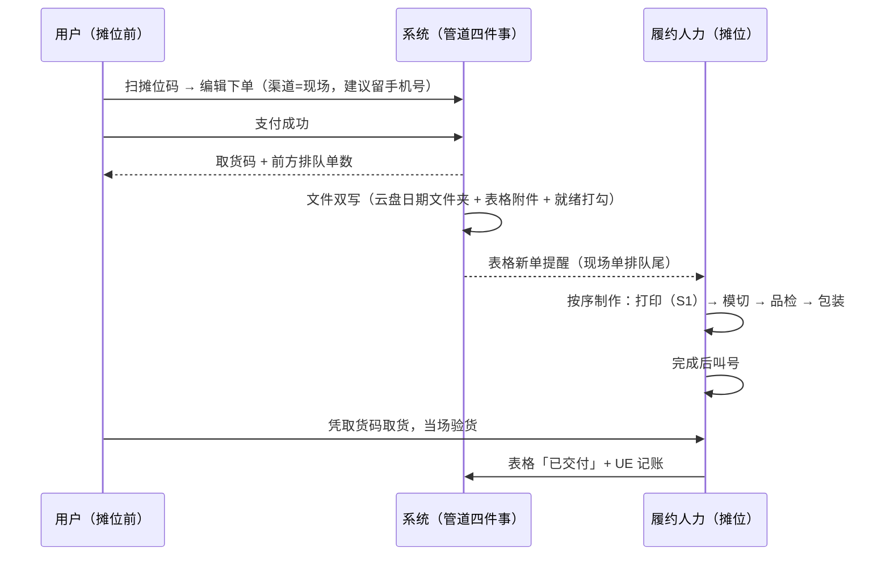
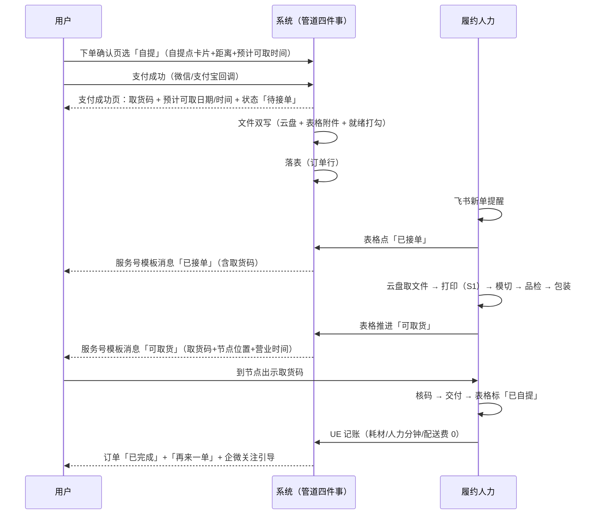

# Phase 0 履约链路：双方 UX Journey（v1.0）

> **用途**：内部定稿基线——「下单 → 支付 → 制作 → 到手」全链路，按**用户**与**履约人力（1 名）**两条线并列，中间标注系统动作。核对通过后据此成文 `FULFILLMENT-PRD.md`。
> **范围**：衔接 `SOD.md` 用户旅程 #10-12（下单/支付/履约收货）。编辑器、计价、券等前置环节见 `WEB-APP-PRD.md`，不重复。
> **口径**：整单派发、拼版在文件层、飞书表格跑单均引 `PLATFORM.md` §8.0/§8.1。履约耗时一律「待实测」，0a 阶段校准（UE 账本「人力分钟数」的采集目的）。
> **版本**：v1.0（2026-09-30）。本轮拍板：①快递承诺 T+2；②现场单升格为 Phase 0a 首发形态；③数据底座=飞书表格+四件事管道；④开放问题全部定基线值。

---

## 1. 总结构：两步走

**Phase 0a 现场单（首发）→ Phase 0b 常规单（自提+快递）**

| | 0a 现场单 | 0b 常规单 |
|---|---|---|
| 场景 | 漫展/快闪摊位，当场做当场拿 | 线上下单，自提或快递 |
| 闭环大小 | 最小：无物流、无推送依赖、无营业时间 | 完整：配送选择、状态推送、取货码 |
| 验证什么 | 设备稳定性、单均耗时、现场转化、定价、UE 成本 | 自提占比、兑现率、私域沉淀（Gate 0 口径） |
| 对齐节奏 | W3-6 市场验证（漫展档期） | 0a 毕业后开（毕业条件见 §2.3） |

先跑 0a 的逻辑：用最小的闭环把**设备、SOP、耗时、成本**全部实测出来，0b 的截单时刻、SLA、异常 SOP 全部用 0a 的真实数据定，不猜。

**系统 = 最小后端管道（无界面，四件事）**：
1. **文件双写**：支付成功 → 导出打印文件 → 飞书云盘日期文件夹（主通道）+ 表格附件字段（备份）+ 表格「文件就绪」打勾
2. **落表**：订单行写入飞书多维表格（数量/配送方式/联系方式/UE 字段占位）
3. **状态回传**：表格状态变更（webhook）→ 用户端订单详情 + 服务号模板消息（短信兜底）
4. **单号回填**：快递单号人工回填表格 → 管道同步用户端物流页

**节点与人力**：办公场地一角即自营节点；1 名履约人力（兼职学生可担）；自提点本期一处，数据结构按多自提点设计（Phase 1 挂机店预留）。

## 2. Phase 0a：现场单（首发形态）

### 2.1 时序

### 2.2 双侧 journey

**用户侧（摊位前）**

| 阶段 | 用户动作 | 所见 | 关注点 |
|---|---|---|---|
| 扫码下单 | 扫摊位码，现场编辑 | web app 编辑器（渠道=现场） | 几分钟能做出好看的吗 |
| 支付 | 付款 | 支付成功页：取货码 + 前方排队单数 + 预计等待 | 前面几单、等多久 |
| 等待 | 逛展（可离摊） | 回来看叫号/问进度 | 会不会错过、做坏怎么办 |
| 取货 | 凭码取，当场验货 | 核码交付 | 和屏幕所见一致吗——所见即所得的兑现时刻 |
| 离场 | 可选：扫公众号码 | 关注引导（复购+私域入口，Gate 0 沉淀率起点） | — |

**履约侧（摊位）**

| 步骤 | 动作 | 工具 | 异常出口 |
|---|---|---|---|
| 收单 | 表格新单提醒，现场单排队尾 | 飞书表格（手机端） | 积压 → 摘牌暂停接单 + 告知 |
| 取文件 | 云盘当日文件夹取文件（`订单号-作品序号-份数`） | 飞书云盘 | 缺失 → 表格附件字段备份兜底 + 补导出 |
| 打印→模切 | S1 输出 | S1 一体机 | 重打（损耗记 UE）；连续故障 → §4-A |
| 品检→包装 | 对照表格缩略图核对 | 飞书表格 | 不合格 → 当场重做；不可修复 → 现场全额退款 |
| 叫号交付 | 核码交付，标「已交付」 | — | 超时未取 → 闭展前电话（现场单建议留手机号的原因） |
| UE 记账 | 耗材/人力分钟/异常标记（配送费=0） | 飞书表格 | 漏记 → 闭展复盘补录 |

### 2.3 毕业条件（0a → 0b）

- 连续 2 场活动设备零重大故障（单场停机 >30 分钟为重大）
- 单均全流程耗时实测值稳定（连续 2 场波动 <20%）
- 现场转化率、定价接受度有初步数据（W3-6 双入口对照）
- 服务号认证完成（0b 推送依赖）

## 3. Phase 0b：常规单（自提 + 快递）

### 3.1 时序（主线：自提）

快递主线仅交付段分叉：包装完成 → 表格回填快递单号 → 管道同步「已发货」+ 推送 → 物流页可查 → 签收 → 已完成。

### 3.2 用户侧 journey（瑞幸式状态流）

> 状态序列：`待接单 → 已接单 → 制作中 → 可取货（自提）/ 已发货（快递）→ 已完成`

| # | 阶段 | 用户动作 | 所见（web app / 服务号） | 关注点 |
|---|---|---|---|---|
| U0 | 选配送方式 | 下单确认页选「自提 / 快递」；选自提时见自提点卡片（名称/地址/距离/营业时间/预计可取时间） | 配送方式区 + 自提点卡片；默认地址距节点 >5km 时提示「较远，也可选快递」 | 自提省多少、快多少、去哪取——选时就答完 |
| U1 | 支付成功 | 无 | 支付成功页：**取货码（订单号派生 4-6 位）**、预计可取时间（截单前 T+0 / 截单后次日）、状态「待接单」 | 瑞幸式确定性——付完钱立刻知道几号取、何时取 |
| U2 | 已接单 | 被动（可关页面） | 服务号模板消息「已接单」+ 订单详情同步 | 「有人管我的单了」——消除黑箱感 |
| U3 | 制作中 | 被动等待 | 订单详情「制作中」+ 预计时间 | 从简：状态+预计时间，不做实时进度条 |
| U4 | 可取货通知 | 点消息 / 自行打开订单 | 「可取货」：取货码 + 节点位置（导航链接）+ 今日营业截止 | 去哪取、几点前取、出示取货码即可 |
| U5 | 取货 | 到节点出示取货码 | 履约人力核码交付 | 与画布所见一致吗——所见即所得兑现时刻 |
| U6 | 已完成 | 无 | 「已完成」+「再来一单」+ 企微关注引导 | 复购钩子 + 私域沉淀入口 |
| U7 | 售后（可选） | 订单页入口 / 企微客服 | 退款/补做结果回写订单 | 品质问题有兜底（§4） |

快递线差异：U0 显示运费规则（N=1 收 5 元 / N≥2 包邮）与「预计 T+2 达」；U4 换「已发货」+ 快递单号 + 物流页；U5/U6 合并为「签收 → 已完成」。

**价格联动**：自提 = 免运费（N=1 省 5 元）；N≥2 用户侧运费均 0，差异在时效（自提 T+0 vs 快递 T+2）。平台侧每笔自提单省同城快递成本——UE 最大杠杆（`BRIEF.md` §6 自提口径）。

### 3.3 履约侧 journey（1 名人力 SOP）

> 与用户侧对照：F1-F7 对应 U2-U3，F8 对应 U4，F9-F10 对应 U5-U6。

| # | 步骤 | 动作 | 工具 | 耗时 | 异常出口 |
|---|---|---|---|---|---|
| F1 | 接单 | 收新单提醒 → 表格点「已接单」（触发推送） | 飞书表格（手机端） | 待实测 | 高峰积压 → §4-E |
| F2 | 取文件 | 云盘当日文件夹取文件（`订单号-作品序号-份数`） | 飞书云盘 | 待实测 | 缺失 → 表格附件备份 + 管道补导出；主动告知用户制作延长 |
| F3 | 拼版核对 | 检查可打印性（尺寸/安全区），同批合版打印（拼版在文件层，不拆单） | 打印队列 | 待实测 | 不可打 → 同 F2 出口 |
| F4 | 打印 | S1 输出 | S1 一体机 | 待实测 | 卡纸/色偏 → 重打（损耗记 UE）；连续故障 → §4-A |
| F5 | 模切 | 按模切轮廓切割 | S1 一体机 | 待实测 | 切偏 → 重做；不可修复 → §4-B |
| F6 | 品检 | 对照表格缩略图核对内容与数量 | 飞书表格 | 待实测 | 不合格 → 重做；无法重做 → §4-B |
| F7 | 包装 | 装袋 + 贴面单（取货码/收件信息） | 包装台 | 待实测 | — |
| F8 | 状态推进 | 表格推进「可取货/已发快递」→ webhook 回传 + 推送；快递单号回填 | 飞书表格 | 待实测 | 回传失败 → 人工企微/短信先告知，再排查管道 |
| F9 | 交付 | 自提：核码交付标「已自提」；快递：交发快递员 | — | 待实测 | 超时未取 → §4-D |
| F10 | UE 记账 | 补齐 UE 字段（耗材/人力分钟/配送费/异常标记） | 飞书表格 | 待实测 | 漏记 → 周复盘补录 |

### 3.4 配送形态矩阵（承诺已拍板）

| 层 | 形态 | 承诺话术 | 时效 | 成本 | 适用 | 验证指标 |
|---|---|---|---|---|---|---|
| 1 | **自提（默认推荐）** | 「今日下单，今日可取」 | T+0（截单 18:00） | 0 运费 | 节点 3-5km、通勤顺路 | 自提占比 ≥40% |
| 2 | 同城普通快递 | 「48 小时内送达」 | **T+2** | N=1 收 5 元 / N≥2 包邮（`SOD.md` 计价） | 自提半径外、不想到店 | 签收时效、运费承担分布 |
| 3 | 现场单（Phase 0a） | 「当场做，当场拿」 | 分钟级 | 免运费 | 漫展/快闪 | 现场转化率（双入口对照） |
| — | 闪送 | 不进本期 | — | 打穿 10 元订单（`PLATFORM.md` 支柱①） | 人工客服个案通道收集需求 | 个案登记数 |

**逻辑**：0a 现场单承担「极致的快」展示；0b 层 1 自提是 UE 最大杠杆；层 2 快递 T+2 是保守承诺（同城快递通常 T+1 到，承诺 T+2 留缓冲——兑现率优先于话术好看，Gate 0「当日达兑现率 ≥80%」的口径精神）。若 T+2 实测长期富余，再收紧话术，不反向。

## 4. 异常流五条（0b 口径，0a 简化版见 §2.2）

| # | 异常 | 处理路径 | 用户侧话术/补偿 |
|---|---|---|---|
| A | 设备故障（S1 不可用） | 当日订单挂起 → 推送受影响用户：改快递 T+2 或次日取 | 主动告知 + 免运费券（若产生运费差） |
| B | 品质不可修复 | 表格标异常 → 电话/企微联系：重做（顺延一档时效）或退款 | 二选一，默认重做优先 |
| B2 | 品检发现数量短缺（缺张） | 制作段发现即补打（不惊动用户）；交付后发现 → 补寄/补偿 | 交付前闭环优先 |
| C | 取消退款（制作前） | 用户申请 → 表格拦截 → 原路退款 | 全额退，即时确认 |
| D | 超时未取 | 表格预警 → 推送提醒 D+3、D+6 → 超期 D+7 转寄（到付）或退款扣运费 | 提醒 2 次后电话确认 |
| E | 客单积压（单量突增） | 当日可做完 → 正常；做不完 → 截单后订单自动顺延 T+1 | 预计时间顺延，主动通知 |

## 5. 账号与触达

- **登录**：微信扫码 + 手机号验证码双通道（`WEB-APP-PRD.md` §3.1）。
- **下单强制可触达**：微信登录用户（仅 openid）首次下单补绑手机号，无手机号不提交订单（异常时电话是最后兜底）。
- **推送主通道**：认证服务号模板消息（已接单/可取货/已发货）；短信兜底（未关注/取关）；企微客服做私域沉淀（订单页入口 + 完成页引导）。
- **资质前提**：企业主体认证服务号，认证 1-2 周——**0a 阶段并行办理**（0b 毕业条件之一）。
- **隐私底线**：原图处理完即删（`SOD.md`）。

## 6. UE 记账采集点

| 字段 | 采集时机 | 采集人 |
|---|---|---|
| 耗材成本（含重打损耗） | 打印/模切完成即记 | 履约人力 |
| 人力分钟数 | 各步骤（或整单一段式） | 履约人力 |
| 配送费 | 快递交发后（自提=0） | 履约人力 |
| 异常标记（客诉/退货/重做） | 发生时 | 履约人力 |
| 时间戳（下单→接单→打印→交付） | 状态推进时 | 表格自动/手动 |

Gate 0 数据汇总直接从表格出，零二次加工（`PLATFORM.md` §8.1 W1-2 跑单表格字段定版）。

## 7. 文件落盘与高成功率机制（数据底座拍板后的落地细节）

**问题回顾**：打印文件要落到履约电脑「打印工作目录」（按日期分文件夹、文件名即打印队列），人力不进任何系统下载，直接拖给 S1。怎么做到高成功率？

**双写设计（v1.0 修正：不依赖「本地同步盘」单一通道）**：

| 通道 | 内容 | 作用 |
|---|---|---|
| 主通道 | 管道写**飞书云盘**日期文件夹（`/打印队列/2026-10-05/订单号-作品序号-份数.pdf`） | 0a 现场就在用（摊位电脑登录飞书即可见），履约流程 F2 已经在跑「云盘取文件」 |
| 备份通道 | 同一文件挂**表格附件字段**（一行一附件） | 云盘网络故障时的兜底下载源；也是品检对照缩略图的来源 |
| 就绪校验 | 管道写完两处后在表格「文件就绪」字段打勾 + 文件字节数 | 人力跑单前扫一眼：**勾在=文件在**；F2 异常率可视 |

**为什么高成功率（三层递进）**：

1. **支付即双写，不存在「事后补文件」**：文件生成是支付回调的同步动作，不是履约人力的检索动作。人力永远不做「找文件」，只做「取文件」。
2. **就绪打勾 = 每单对账**：管道没写成功（导出失败/上传失败）→ 勾不出现 → 表格该行显式异常 → 人力立刻看到，F2 之前就拦截。把「文件丢了」从**运行时事故**变成**表格里的一行红字**。
3. **双通道冗余**：主通道（云盘）和备份（表格附件）是两个独立存储，同时失败概率极低；任一可用即履约不中断。

**失败兜底链**（按顺序尝试，全程 0 界面）：云盘当日文件夹 → 表格附件字段下载 → 管道管理端点手动重导（1 条命令/1 次点击重试导出）→ 判定导出本身失败（编辑器渲染问题）→ 走 §4-B 品质异常路径联系用户。

**0a 现场验证点**：这套双写在 0a 就完整跑（现场单也双写+打勾），漫展网络环境是比办公室更恶劣的实测场——0a 毕业即证明机制可靠，0b 直接复用。

## 8. 已定基线（开放问题全部关闭，PRD 按此写）

| # | 项 | 基线值 |
|---|---|---|
| 1 | 截单时刻 | 18:00（真实值待 0a 实测反推，PRD 留 SLA 字段） |
| 2 | 自提营业时间 | 10:00-20:00，周末必覆盖（与人力排班对齐） |
| 3 | 超时未取 | D+3 / D+6 推送提醒，D+7 转寄（到付）或退款扣运费 |
| 4 | 快递超区 | 运费一刀切 5 元先跑，个案人工补差或转自提 |
| 5 | 通知渠道 | 服务号模板消息主 + 短信兜底 |
| 6 | 服务号认证 | 0a 阶段并行办理（0b 毕业条件之一） |
| 7 | 数据底座 | 飞书表格 + 四件事管道（§7 双写机制保成功率） |

---

> **一句话总结**：Phase 0a 现场单先行（最小闭环实测设备/SOP/耗时/成本）→ 0b 常规单（自提 T+0 默认 + 快递 T+2 承诺）；管道四件事，文件双写+就绪打勾保履约不丢文件；推送走服务号+短信兜底；每单落 UE 账本，Gate 0 出分。
