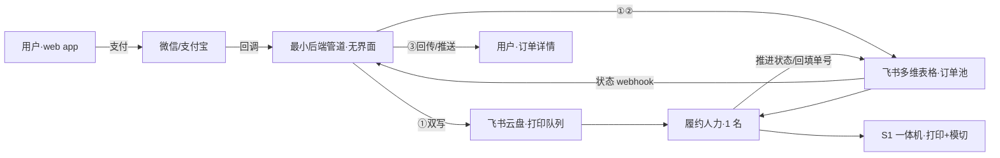
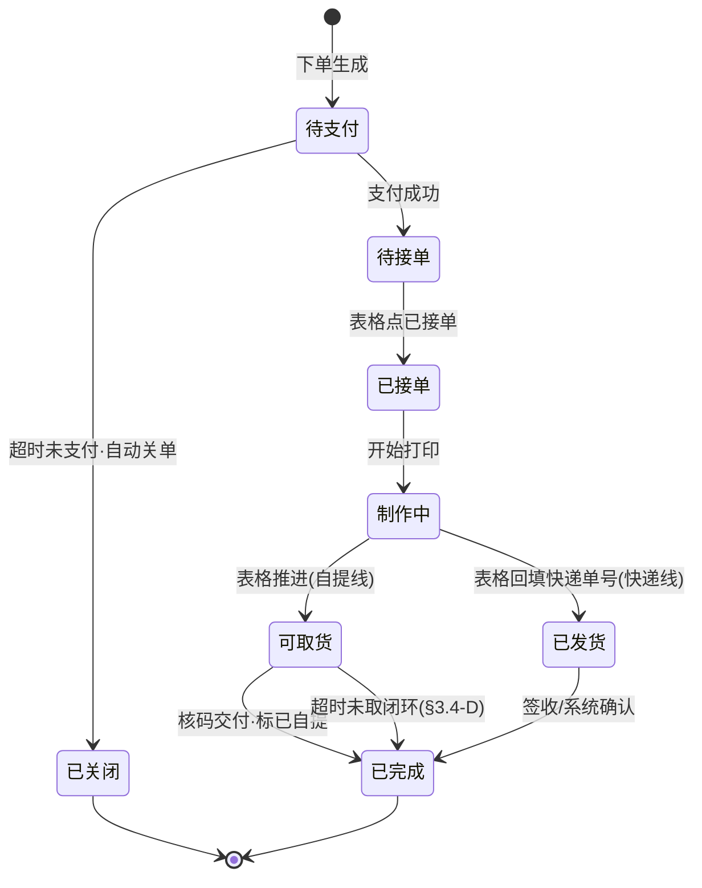
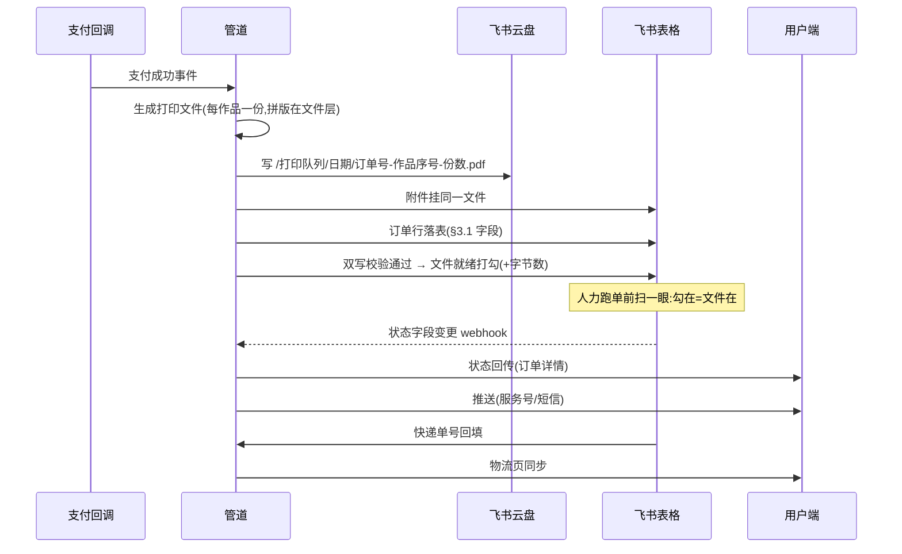

# Phase 0 履约链路 PRD（v1.1）

> **用途**：履约侧开发依据。规格化 `FULFILLMENT-JOURNEY.md` v1.1（已核对定稿）全部拍板：0a 现场单首发（六步主旅程，状态机 v2 全线，通知三层兜底，渠道归因）、0b 常规单（自提+快递 T+2）、管道四件事、文件双写、已定基线。
> **范围**：支付成功 → 用户到手。编辑器、计价、券、登录见 `WEB-APP-PRD.md`；商业约束见 `SOD.md`；战略口径见 `PLATFORM.md` v2.1a，引用不复制。
> **边界**：本文只含**用户侧增量规格**（配送方式区 / 取货码 / 状态机 v2 / 通知触点 / 渠道归因）与**履约侧全量规格**（表格 / SOP / SLA / 管道）。`WEB-APP-PRD.md` 主线不变，增量以本文为准。

---

## 1. 文档说明

### 1.1 两态结构（继承 journey §1）

| | Phase 0a 现场单 | Phase 0b 常规单 |
|---|---|---|
| 用户侧增量 | 渠道参数、取货码、排队数、通知触点（三层兜底） | 配送方式区、状态机 v2、取货码、通知触点 |
| 履约侧 | 同一套表格 + SOP（交付段简化：无物流；状态机同 v2 全线） | 全量 |
| 开启条件 | W3-6 漫展档期（`PLATFORM.md` §3.1 第一层） | 0a 毕业条件（journey §2.5） |

### 1.2 系统拓扑

- **履约人力**（1 名，兼职学生可担）：飞书表格跑单，S1 制作，核码交付（SOP 见 journey §3.3 / §2.2）。
- **最小后端管道**：无界面服务进程，只做四件事（§4）。
- **明确不建**：后台界面、商家端（`PLATFORM.md` §8.0「验证阶段两个都不建」；表格→代码切换信号：日均单量 >30 / 人工丢件错单 / 商家数 >3）。

### 1.3 术语（复用 `WEB-APP-PRD.md` §1.3，仅新增最小集）

| 术语 | 含义 |
|---|---|
| 管道四件事 | 文件双写、落表、状态回传、单号回填（§4） |
| 双写 | 打印文件写飞书云盘（主）+ 表格附件（备份），两处完成后表格「文件就绪」打勾 |
| 取货码 | 订单号派生 4-6 位数字，核码交付用（§2.3） |
| 截单 | 当日可取的下单截止时刻（基线 18:00，待 0a 实测反推，§3.3） |

---

## 2. 用户侧增量规格

> 只列对 `WEB-APP-PRD.md` 的增量，未列出者不变。

### 2.1 下单确认页：配送方式区（仅 0b）

- **位置**：地址卡上方；**默认选中「自提」**（UE 最大杠杆，journey §3.2 价格联动）。
- **自提卡片**：自提点名称 / 地址 / 距离 / 营业时间（10:00-20:00）+ 预计可取时间（截单 18:00 前 T+0，之后次日）；免运费。
- **快递卡片**：运费规则（N=1 收 5 元 / N≥2 包邮，`WEB-APP-PRD.md` §5.3）+「48 小时内送达」；选快递才需地址（无地址时引导新增）。
- **默认地址距节点 >5km**：自提卡片提示「较远，也可选快递」，不阻止选择。

### 2.2 支付成功页（0a / 0b 共用）

- **取货码**（大字号）：0a 现场单 + 0b 自提单展示；0b 快递单不展示。
- **0a 追加**：前方排队单数 + 预计等待。
- **0b 自提追加**：预计可取日期/时间 + 节点位置。
- **状态起点**：「待接单」（状态机 v2 见 §2.4；`WEB-APP-PRD.md` §5.2 四态为其真子集）。
- **0a 入口**：活动专属二维码（`?ch=booth-日期-活动名`，journey §2.4）→ 编辑器简化模式（`WEB-APP-PRD.md`）→ 渠道来源随订单落表。

### 2.3 取货码

- **生成规则**：订单号数字段哈希取 4-6 位，订单生成时确定，含于落表字段，状态回传同步展示。
- **展示位置**：支付成功页 / 订单详情 / 「可取货」推送内。
- **核验**：人工比对（1 节点 1 人力），不做扫码设备。

### 2.4 订单状态机 v2

| 状态 | 触发 | 用户侧可见 | 备注 |
|---|---|---|---|
| 待接单 | 支付成功 | 取货码+预计时间 | 新增；`WEB-APP-PRD.md` 的「制作中」在此拆细 |
| 已接单 | 表格「已接单」→webhook | 服务号推送 | 消除黑箱感 |
| 制作中 | 表格「打印中」 | 订单详情+预计时间 | 不做实时进度条 |
| 可取货 | 表格「可取货」 | 取货码+位置+营业截止 | 仅自提线 |
| 已发货 | 表格回填单号 | 「查看物流」 | 物流页（快递100 接通） |
| 已完成 | 核码交付 / 签收 | 「再来一单」+关注引导 | 终态 |
| 已关闭 | 超时未支付 | 同 `WEB-APP-PRD.md` | 关单不可恢复 |

- **0a 现场单**：状态机同 v2 全线 `待接单 → 已接单 → 制作中 → 可取货 → 已完成`（用户可离摊逛展，「可取货」推送告知）；仅时效压缩为分钟级、无「已发货」分支。
- **异常分支**（取消退款 / 品质重做）不改状态名，订单详情内以标记位呈现（§3.4）。
- **排队进度**（0a）：订单详情页显示「前方 N 单」（管道聚合表格中「待接单+已接单+打印中」现场单计数），瑞幸式透明排队；0b 不展示（非当日场景，无排队心智）。

### 2.5 通知触点（0a 三层兜底 / 0b 双通道）

| 事件 | 主通道 | 兜底 1 | 兜底 2（仅 0a） |
|---|---|---|---|
| 已接单 | 服务号模板消息（含取货码） | 短信（未关注/取关） | 摊位屏幕（平板表格视图） |
| 可取货 | 服务号模板消息（码+位置+截止） | 短信 | 摊位屏幕叫号 |
| 已发货（0b） | 服务号模板消息（单号） | 短信 | — |
| 异常告知 | 服务号 + 电话（最后兜底） | — | — |

- 前提：认证服务号（0a 阶段并行办理，journey §8-6；0a 主通知通道之一）。
- 下单强制可触达：微信登录用户首次下单补绑手机号，无手机号不提交（0a/0b 同口径，journey §5）——异常时电话是最后兜底，0a 闭展前未取件也靠它。
- 摊位屏幕层：平板开飞书表格现场单视图（排队序=行序），零开发成本，也是用户回摊问进度的物理看板。

---

## 3. 履约侧规格

### 3.1 飞书多维表格 schema（0a/0b 同一张表）

> W1-2 建表，字段定版即 `PLATFORM.md` §8.1 W1-2 第 5 项落地。一行 = 一订单。

| 字段 | 类型 | 说明 / 枚举 |
|---|---|---|
| 订单号 | 单行文本 | 主键，用户侧同号 |
| 渠道 | 单选 | 现场 / 线上 |
| 渠道来源 | 单行文本 | 活动专属二维码 scene 参数（如 `booth-20261005-漫展名`）；线上单留空。获客归因数据底座（journey §2.4） |
| 配送方式 | 单选 | 自提 / 快递 / 现场交付（0a 固定值） |
| 用户 / 手机号 | 文本 / 电话 | 核码与异常兜底用 |
| 作品数·总张数 N | 数字 | 计价与耗材对账 |
| 实付（元） | 数字 | |
| 配送地址 | 文本 | 快递单必填 |
| 状态 | 单选 | 待接单 / 已接单 / 打印中 / 可取货 / 已发货 / 已自提 / 已完成 / 异常（0a 走同一全集，现场交付以「可取货 → 已自提」收尾） |
| 文件就绪 | 勾选 | 管道双写完成后打勾（§4.2） |
| 打印文件 | 附件 | 双写备份通道 + 品检缩略图来源 |
| 快递单号 | 文本 | 人工回填（§4 第 4 件事） |
| 取货码 | 文本 | §2.3 |
| **UE·耗材成本** | 数字 | 打印/模切完成即记（含重打损耗） |
| **UE·人力分钟** | 数字 | 整单一段式（0a）或分步（0b），0a 实测后定 |
| **UE·配送费** | 数字 | 自提=0；快递交发后记 |
| **UE·异常标记** | 多选 | 客诉 / 退货 / 重做 / 设备故障 |
| 备注 | 文本 | 异常处理记录 |

- **视图**：按状态分视图（待接单 / 制作中 / 待交付 / 已完成）+ 当日筛选；0a 现场单单列视图（排队序即行序）。
- **UE 字段是 Gate 0 出分的直接来源**，零二次加工（journey §6）。

### 3.2 跑单 SOP

- **F1-F10 全流程**：见 journey §3.3（接单 → 取文件 → 拼版核对 → 打印 → 模切 → 品检 → 包装 → 状态推进 → 交付 → UE 记账），每步含工具与异常出口，本文不复制。
- **0a 现场变体**：journey §2.2（六步主旅程双侧对照：收单排队、摘牌暂停、闭展前电话、闭展复盘补录）。
- **0a 现场纪律**：
  - **排队上限**：待制作单数达上限即摘牌暂停接单（摊位物理牌），恢复后重新挂出——保护等待体验。
  - **手机号强制**：0a 与 0b 同口径「下单强制可触达」（§2.5），超时未取闭展前电话用。

### 3.3 SLA 基线（journey §8 已定，此处为执行口径）

| 项 | 基线 | 备注 |
|---|---|---|
| 截单时刻 | 18:00 | 待 0a 实测反推，管道留配置项 |
| 自提营业时间 | 10:00-20:00 | 周末必覆盖，与人力排班对齐 |
| 自提时效 | T+0（截单前）/ T+1（截单后） | 承诺话术「今日下单，今日可取」 |
| 快递时效 | T+2「48 小时内送达」 | 兑现率优先；实测富余再收紧，不反向 |
| 超时未取 | D+3 / D+6 推送提醒，电话确认；D+7 转寄（到付）或退款扣运费 | |
| 快递超区 | 运费一刀切 5 元，个案人工补差或转自提 | |

### 3.4 异常 SOP（journey §4 全表，执行要点）

| # | 异常 | 执行要点 |
|---|---|---|
| A | 设备故障 | 当日订单挂起 → 受影响用户推送：改快递 T+2 / 次日取 + 运费差券 |
| B | 品质不可修复 | 表格标异常 → 电话/企微二选一：重做（顺延一档）优先 / 退款 |
| B2 | 品检缺张 | 交付前补打闭环（不惊动用户）；交付后补寄/补偿 |
| C | 取消退款（制作前） | 用户申请 → 表格拦截 → 原路退款，全额即时 |
| D | 超时未取 | §3.3 时点表执行；转寄/退款结果回写订单 |
| E | 客单积压 | 做不完 → 截单后订单自动顺延 T+1 + 主动通知 |

---

## 4. 系统接缝：最小后端管道（四件事）

> 无界面服务进程。设计原则：文件生成是**支付回调的同步动作**，人力永远只做「取文件」不做「找文件」（journey §7）。

### 4.1 触发与动作总览

### 4.2 文件双写与就绪校验（第 1 件事）

- **主通道**：云盘日期文件夹 `/打印队列/YYYY-MM-DD/订单号-作品序号-份数.pdf`——0a 摊位电脑登录飞书即见，履约流程 F2 直接用。
- **备份通道**：同一文件挂表格附件字段。
- **就绪打勾**：两处均成功才打勾并记录字节数；任一失败 → 勾缺失 → 表格该行显式异常，人力 F2 之前即拦截。**把「文件丢了」从运行时事故变成表格里的一行红字。**
- **失败兜底链**（人力视角，全程 0 界面）：云盘 → 表格附件下载 → 管道重导端点（1 条命令重试）→ 判定导出失败（编辑器渲染问题）→ 走 §3.4-B 品质异常路径。
- **0a 即完整跑双写**：漫展网络是更恶劣实测场，0a 毕业即证明机制可靠，0b 直接复用。

### 4.3 落表（第 2 件事）

支付回调后同步写入 §3.1 全部静态字段（状态初值「待接单」、UE 字段留空待人力补）。

### 4.4 状态回传（第 3 件事）

- **机制**：表格「状态」字段变更 → 飞书 webhook → 管道写用户端订单 + 触发推送（§2.5 触点表）。
- **同步频率**：事件驱动（webhook），用户端订单详情页从简不轮询；Phase 0 不做实时推送优化，表格→代码切换信号（§1.2）触发再升级。
- **失败处理**：回传失败 → 管道重试 + 告警；人力侧话术兜底（人工企微/短信先告知用户，再排查管道）。
- **排队进度（0a）**：管道聚合表格现场单状态计数（待接单+已接单+打印中），随状态回传同步刷新订单页「前方 N 单」；聚合值不落表，实时算。

### 4.5 单号回填（第 4 件事）

表格「快递单号」字段人工回填 → webhook → 管道同步用户端物流页（快递100 查询，`PLATFORM.md` §8.0 通用基础设施）。

### 4.6 非功能

- **幂等**：支付回调重试不产生重复订单行（订单号唯一约束）。
- **可观测**：双写失败 / 回传失败进告警群；每日对账——表格行数 vs 当日支付成功数。
- **隐私**：打印文件仅存云盘与表格附件，交付完成后按 `SOD.md` 隐私底线处置；用户原图处理完即删。

---

## 5. 待定项

| 项 | 依赖 | 当前处理 |
|---|---|---|
| 打印文件精确规格（DPI / 出血 / 拼版细节） | S1 PRD | 继承 `WEB-APP-PRD.md` §6 待定项口径 |
| 快递服务商选择 | 单量与价格谈判 | 基线：同城普通快递，T+2 承诺已含缓冲 |
| 服务号认证 | 资质流程 1-2 周 | 0a 阶段并行办理（0b 毕业条件） |
| 0a 排队上限具体数值 | 现场实测 | 首场保守值，按实测调整 |
| 截单时刻真实值 | 0a 单均耗时数据 | 基线 18:00，管道留配置项 |

## 6. 不做项

- 闪送系统化（人工客服个案通道收集需求信号，journey §3.4）
- 挂机店自提、多节点派单（Phase 1，`PLATFORM.md` §8.2）
- 商家端、平台后台界面（`PLATFORM.md` §8.0 切换信号触发前不建）
- 实时进度推送、取件柜 / 扫码核销设备（1 节点 1 人力，人工核码即可）

---

> **一句话总结**：0a 现场单首发（六步主旅程：扫码获客→当场制作→排队推送→凭码取件→离场转化；状态机 v2 全线、通知三层兜底、渠道归因落表）→ 0b 常规单（自提 T+0 默认 + 快递 T+2）；0a/0b 同一套状态机、同一张表、同一条管道，差异仅参数；管道只做四件事，文件双写+就绪打勾保履约不丢文件；UE 字段落表格字段级，Gate 0 直接出分。

