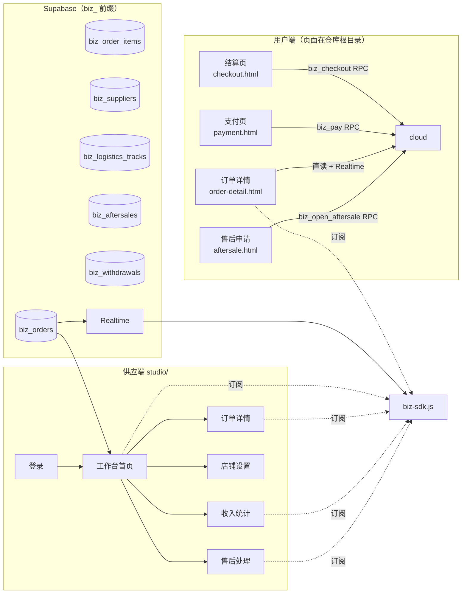
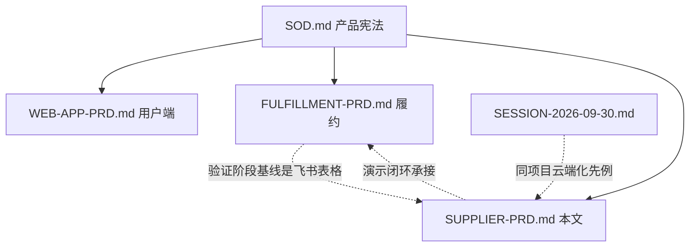

# 供应端工作台 PRD（v1.0）

> **用途**：供应端（商家工作台 `studio/`）开发依据。规格化本轮已实现的供应端全量功能与用户端云端化改造，作为演示阶段（Phase 0）的供应侧基线文档。
> **范围**：商家登录 → 工作台 → 订单处理 → 收入提现 → 店铺设置 → 售后处理全流程；用户端订单/物流/售后页的云端化联动增量。
> **边界**：用户端主线（编辑器/计价/券/登录）见 `WEB-APP-PRD.md`；履约 SOP/SLA/管道见 `FULFILLMENT-PRD.md`；商业约束见 `SOD.md`；战略口径见 `PLATFORM.md`。引用不复制。
> **与 `FULFILLMENT-PRD.md` 的关系**：该文档 §1.2「验证阶段不建商家端」基于 2026-09 的飞书表格跑单基线。本 PRD 对应的 studio/ 是**演示验证形态**（GitHub Pages + Supabase，无服务器），用于向利益相关方演示「用户下单 → 供应端履约」的完整闭环；「表格 → 工作台」的切换信号（日均单量 >30 / 人工丢件错单 / 商家数 >3）到达后，本 PRD 升级为正式供应端产品的规格基线。

---

## 1. 文档说明

### 1.1 定位与背景

| | 说明 |
|---|---|
| 产品形态 | 桌面 Web 工作台（纯静态 HTML/CSS/JS，零构建，GitHub Pages 托管） |
| 数据层 | Supabase Postgres（`biz_` 前缀表）+ Realtime + SECURITY DEFINER RPC |
| 用户 | 签约供应商（工作室/个体户），每店 1 个账号 |
| 目的 | ① 演示「平台派单 → 供应商履约」闭环，证明供应端价值；② 沉淀正式供应端产品的结构基线 |
| 与 demo_ 表关系 | 同一 Supabase 项目，`biz_` 与 `demo_` 前缀完全隔离，互不干扰 |

### 1.2 系统拓扑

### 1.3 术语

| 术语 | 含义 |
|---|---|
| 派单 | 下单时按收货地址 region 自动匹配服务地区供应商；未命中走默认供应商 |
| 发号器 | `biz_counters` 表 + 行锁，订单号 `SO + yyyymmdd + 3 位序号` |
| 状态机 v2 | `pending → paid → accepted → making → shipped → done`（+ `closed` / `aftersale`） |
| 服务端权威计价 | `biz_checkout` RPC 内重算金额并与前端 `amountExpect` 校验，不符即拒单 |
| 双轨运行 | 用户端各页云端优先，`Cloud.ok()` 为假时回退本地 localStorage 行为 |

### 1.4 非目标（Non-Goals）

- 不做真实支付（`biz_pay` 是状态翻转，非资金流）
- 不做真实物流对接（单号可手填或模拟生成，轨迹仅首条）
- 不做供应端账号体系（模拟密码 123456，localStorage session）
- 不做多角色权限（单店单账号，无主账号/子账号）
- 不做移动端适配（工作台为桌面布局）

---

## 2. 页面规格

### 2.1 商家登录页（`studio/login.html`）

**目的**：选店铺 + 输密码完成登录，守卫未登录访问。

| 要素 | 规格 |
|---|---|
| 店铺选择 | 下拉列表，数据来自 `Biz.listSuppliers()`（biz_suppliers 直读） |
| 密码 | 输入框，演示密码统一 `123456`，错误时 toast 提示（含提示文案） |
| 登录动作 | 调 `biz_login` RPC 校验，成功后 session 写 `localStorage[sod.biz.session]`，跳 `index.html` |
| 登录守卫 | `Biz.requireSession()`：非登录态访问任何工作台页 → `location.replace('login.html')` |
| 风格 | 复用用户端登录页视觉（奶油暖色、圆角卡片），studio.css 变体 |

### 2.2 工作台首页（`studio/index.html`）

**目的**：待处理队列 + 今日运营概览 + 耗材预警，一屏看清今天要做什么。

| 区块 | 规格 |
|---|---|
| 待处理队列 | 按支付时间正序（FIFO），状态 ∈ {paid, accepted, making}，逐单处理；卡片含订单号/用户/张数/金额/状态 pill/相对时间；点击进详情 |
| 今日统计 | 新订单数（今日 paid）/ 完成数（今日 done）/ 收入（今日 done 金额合计，元） |
| 耗材预警 | 云母纸 / 亚银纸余量 < 20 张时预警条（红色提示 + 引导去设置页补货） |
| 实时刷新 | Realtime 订阅（订阅成功即拉取）+ 5s 轮询兜底；回调 250ms 防抖合并 |
| 空态 | 队列空时显示「暂无待处理订单」+ 说明文案 |

### 2.3 订单详情页（`studio/order-detail.html`）

**目的**：单订单完整信息 + 逐状态推进动作。

| 区块 | 规格 |
|---|---待
| 订单信息 | 订单号 / 用户 / 下单时间 / 状态 pill / 备注全文 |
| 贴纸快照 | `biz_order_items` 列表：缩略图（dataURL）/ 名称 / 张数 |
| 金额 | 商品小计 / 运费 / 券折扣 / 实付（分→元格式化） |
| 收货地址 | name / phone / region / detail（jsonb 字段直展） |
| 状态时间线 | 六阶段：待支付→待接单→已接单→制作中→已发货→已完成；时间戳取对应 *_at 字段 |
| 处理动作 | 按当前状态显示：待接单→[接单]；已接单→[开始制作]；制作中→[发货]；已发货→[完成] |
| 发货弹层 | 物流公司（默认中通快递）+ 运单号（留空自动生成 `ZT+时间+随机`）；确认后 `biz_supplier_action('ship')` 并写入首条轨迹 |
| 售后入口 | 已完成订单显示「售后记录」区块（若有） |

### 2.4 收入统计页（`studio/income.html`）

**目的**：时间维度收入汇总 + 每单明细 + 提现。

| 区块 | 规格 |
|---|---|
| 时间筛选 | 今日 / 7 日 / 30 日 / 全部 四档 tab |
| 收入汇总卡 | 完成单数 / 总收入（分→元）/ 平均客单价 / 待提现余额 |
| 明细表 | 每单：订单号 / 完成时间 / 张数 / 净收入（实付金额） |
| 提现模拟 | 按钮调 `biz_withdraw`（全额提现语义：amount 传空提全部）；成功后余额清零并记 `biz_withdrawals` 流水 |
| 状态结转 | done 结转时机 = `biz_supplier_action('complete')`（shipped→done 同时 `balance += amount`） |

### 2.5 店铺设置页（`studio/settings.html`）

**目的**：店铺基础信息与耗材管理。

| 字段 | 规格 | 约束 |
|---|---|---|
| 自提地址 | 文本 | 空串不覆盖原值（coalesce 保留） |
| 营业时间 | 文本 | 同上 |
| 接单上限 | 数字 | ≥1（greatest(1, …)） |
| 云母纸余量 | 数字（张） | ≥0 |
| 亚银纸余量 | 数字（张） | ≥0 |
| 保存 | `biz_save_settings` RPC | 保存后 toast + 刷新局部 |

### 2.6 售后处理页（`studio/aftersales.html`）

**目的**：售后工单分类处理。

| 区块 | 规格 |
|---|---|
| 分类 tab | 全部 / 重做 / 补寄 / 退款 四档 |
| 工单列表 | 订单号 / 类型 / 原因 / 提交时间 / 状态（open→done） |
| 处理动作 | 「处理完成」按钮 → 弹层填处理结果说明 → `biz_aftersale_action` |
| 状态回转 | 退款：订单转 closed + 供应商余额扣回；重做/补寄：订单回 making |
| 处理记录 | 工单卡片内时间线展示结果 + 完成时间 |

### 2.7 门户入口（`index.html`，用户端增量）

第三张入口卡「商家工作台 供应端」：图标 🏭 + 一句话说明，链至 `studio/login.html`。

---

## 3. 数据与接口规格

### 3.1 表结构（biz_ 前缀，7 张）

| 表 | 用途 | 关键字段 |
|---|---|---用户
| `biz_suppliers` | 供应商 | id / name / password / region_codes[] / address / open_hours / daily_cap / stock_mica / stock_silver / is_default / balance |
| `biz_orders` | 主订单 | id(SO+日期+序号) / user_id / supplier_id / status / n / subtotal / shipping / discount / amount / coupon_type / address(jsonb) / note / ship_company / ship_no / 六个状态时间戳 |
| `biz_order_items` | 贴纸快照 | order_id / name / thumb(dataURL) / copies |
| `biz_logistics_tracks` | 物流轨迹 | order_id / d(描述) / created_at |
| `biz_aftersales` | 售后工单 | order_id / supplier_id / kind(redo/reship/refund) / reason / status(open/done) / result |
| `biz_withdrawals` | 提现流水 | supplier_id / amount |
| `biz_counters` | 发号计数器 | k('order') / v |

### 3.2 RPC 清单（13 个，全部 SECURITY DEFINER）

| RPC | 端 | 入参 → 出参 | 职责 |
|---|---|---|---|
| `biz_price_total(n, coupon)` | 内部 | int→int | 服务端计价（1-2张¥9.9/张、3-4张¥7.9、5+张¥5.9；1张运费¥5、2张+包邮；freeship 抵运费、general 减¥5） |
| `biz_next_order_no()` | 内部 | →text | 发号（行锁防撞号） |
| `biz_match_supplier(region)` | 内部 | text→text | 地址派单（region 匹配 region_codes，未命中走默认） |
| `biz_checkout` | 用户 | user_id, items[], address, coupon_type, note, amount_expect → {ok,id,amount} | 建单 + 服务端权威计价 + 派单 |
| `biz_pay` | 用户 | id → {ok,status} | pending→paid |
| `biz_user_action` | 用户 | id, action(cancel/confirm) → {ok,status} | 取消 / 签收 |
| `biz_open_aftersale` | 用户 | order_id, kind, reason → {ok,id} | 提交售后（订单转 aftersale） |
| `biz_supplier_action` | 商家 | order_id, action(accept/make/ship/complete), payload → {ok,status} | 状态流转单入口；ship 写单号+轨迹，complete 结转货款 |
| `biz_login` | 商家 | supplier_id, password → {ok,id,name} | 模拟登录 |
| `biz_save_settings` | 商家 | supplier_id, settings → {ok} | 店铺设置 |
| `biz_withdraw` | 商家 | supplier_id, amount → {ok,amount} | 提现（空=全额） |
| `biz_aftersale_action` | 商家 | aftersale_id, result → {ok} | 售后处理（refund 扣余额+关单；redo/reship 回 making） |
| `biz_reset` | 内部 | →void | 演示重置（清订单/轨迹/工单/提现，保留店铺配置） |

### 3.3 安全模型

- **RLS**：全部 biz_ 表 anon 只读（Realtime 订阅需要），写操作只能走 RPC 白名单
- **SECURITY DEFINER**：全部 13 个 RPC 绕过 RLS 执行写操作，前端无法绕过状态机
- **幂等设计**：状态流转均带 `where status = 前置状态`，重复点击/断线重试安全
- **金额整数分**：存储与计算全程整数（分），展示层再格式化，避免浮点误差

### 3.4 Realtime 订阅

- 用户端 `Cloud.subscribe(cb)` / 商家端 `Biz.subscribe(fn)`：`supabase.channel` 监听 biz_ 表 postgres_changes，回调后拉取刷新
- 防抖 250ms 合并拉取，避免事件风暴
- 订阅不可用（项目未开 Realtime 或断网）不影响核心功能（轮询兜底 / 手动刷新）

---

## 4. 用户端云端化增量（对 WEB-APP-PRD 的增补）

### 4.1 状态机扩展

`store.js` STATUS_TEXT 增加新状态文案：

| status | 文案 |
|---|---|
| paid | 待接单 |
| accepted | 已接单 |
| making | 制作中 |
| aftersale | 售后中 |

（pending 待支付 / shipped 已发货 / done 已完成 / closed 已关闭 保留原文案）

### 4.2 新增页面

**售后申请页 `aftersale.html`**（从订单详情 shipped/done 状态进入）：
- 类型选择：重做 / 补寄 / 退款 三卡（addr-card + is-active 选中态）
- 理由文本框（必填）
- 提交调 `Cloud.openAftersale(orderId, kind, reason)`；本地降级时 `setStatus('aftersale')`
- 成功后跳回订单详情（状态实时变更为「售后中」）

### 4.3 页面改造明细

| 页面 | 改造点 |
|---|---|
| `checkout.html` | 提交改调 `Cloud.checkout` 单 RPC（服务端计价+发号+派单）；成功后核销本地券→作品转历史→清袋→跳支付页 |
| `payment.html` | 查找订单：本地 || Cloud.get；支付按钮调 `Store.orders.payCloud`（云端优先本地降级） |
| `orders.html` | 云端+本地合并列表（云端优先，本地仅留不在云端的旧记录）；新增「售后中」tab；Realtime 订阅刷新 |
| `order-detail.html` | 六阶段时间线；shipped/done 状态「申请售后」入口；Cloud.ok() 时显示实时同步 pill；Realtime 订阅 |
| `logistics.html` | Cloud.get 兜底；未发货等待占位；签收调 `Cloud.userAction('confirm')`；Realtime 订阅 |

### 4.4 本地降级策略

`Cloud.ok()`（supabase 客户端可用 + config 正确）为假时，所有云端调用自动回退 localStorage 本地行为，页面仍可用。演示时若网络异常，用户端不会白屏。

---

## 5. 验证清单（端到端）

### 5.1 全链路 11 步（SQL 执行完成后）

1. 门户 → 用户端登录 → 编辑器做一张贴纸 → 结算页
2. 选上海地址 → 提交订单（观察订单号 SO+日期+001 格式）
3. 支付页模拟支付 → 状态变「待接单」
4. 门户 → 商家工作台 → 登录上海徐汇工作室（123456）
5. 工作台首页待处理队列出现该单（FIFO）→ 点击进详情
6. 接单 → 开始制作 → 发货（填单号或留空自动生成）
7. 用户端订单详情自动刷新为「已发货」（Realtime）→ 查看物流轨迹
8. 用户端确认收货 → 状态「已完成」
9. 商家端收入统计页出现该单净收入 → 提现模拟
10. 用户端订单详情 → 申请售后（退款）→ 商家端售后处理 → 订单转 closed
11. 工作台「演示重置」清空数据（保留店铺配置）

### 5.2 边界用例

- 地址未匹配地区（如「广东省」）→ 派默认供应商 SUP-SH01
- 金额校验不一致（改前端 amountExpect）→ RPC 拒单并返回差异信息
- 重复状态流转（对 accepted 单再点接单）→ 返回「状态已变更」失败
- Cloud.ok() 为假（断网）→ 用户端本地降级可用
- 售后 refund 后再查供应商余额 → 已扣回
- 发货单号留空 → 自动生成 ZT+时间+随机
- 提现金额超余额 → 提全部（least 语义）

---

## 6. 与其它主文档的关系

- **SOD.md**：定价推导（9.9/7.9/5.9 阶梯与包邮线）在 `biz_price_total` SQL 中复刻
- **FULFILLMENT-PRD.md**：履约 SOP 为其主规格；studio/ 是演示形态的提前实现，切换信号到达后本文升级为正式规格基线
- **PLATFORM.md**：平台化三阶段中「供应端工具」对应本文档，Gate 纪律不变
- **SESSION-2026-09-30.md**：同一 Supabase 项目（haxnoewhzlocblahtnbj）与 GitHub Pages 架构先例，本 PRD 沿用其部署与安全模式

---

## 7. 部署与运维

| 项 | 说明 |
|---|---|
| 托管 | GitHub Pages（静态），与用户端同仓库同域 |
| SQL 迁移 | `supabase/biz-schema.sql`（幂等可重复执行，2026-10-09 已在 SQL Editor 执行） |
| 配置 | `studio/config.js` + 用户端复用 `demo/config.js`（同项目连接；换项目时两处同改） |
| 演示重置 | `Biz.reset()` → biz_reset RPC 清订单类数据，保留店铺配置 |
| 回滚 | biz_ 表与 demo_ 隔离，删除 publication 成员与 RPC 即可完全摘除，不影响演示表 |

---

## 8. 未尽事项与演进方向

- **真实支付/物流对接**：Phase 1+ 议题（微信/支付宝回调、快递 100 API）
- **多角色权限**：主账号 + 制作员子账号（当前单账号演示）
- **耗材联动**：制作完成自动扣减库存（当前手动在设置页维护）
- **售后规则引擎**：仅退款/部分退款/换货细分工单流（当前三分类简化）
- **数据看板**：供应商维度日报/周报推送（当前仅店内自统计）
- **移动端**：PWA 适配（当前桌面工作台）
